<p align="center">
  
</p>

# Manual Técnico — Plataforma EjePresse Radio

> Sitio web de un noticiero regional con **radio en vivo** y **actualidad en video**.
> Documento dirigido al equipo de desarrollo y mantenimiento.

| | |
|---|---|
| **Proyecto** | Noticiero web · Radio en vivo y actualidad (EjePresse Radio) |
| **Versión del documento** | 1.1 |
| **Fecha** | 23 de junio de 2026 |
| **Estado del proyecto** | Scaffold (estructura base + infraestructura lista; pantallas en desarrollo) |
| **Fuente de verdad** | [`Requisitos_Plataforma_Podcast.md`](Requisitos_Plataforma_Podcast.md) |

---

## Tabla de contenido

1. [Propósito](#1-propósito)
2. [Visión general y arquitectura](#2-visión-general-y-arquitectura)
3. [Stack tecnológico](#3-stack-tecnológico)
4. [Estructura del proyecto](#4-estructura-del-proyecto)
5. [Requisitos previos](#5-requisitos-previos)
6. [Puesta en marcha (local)](#6-puesta-en-marcha-local)
7. [Variables de entorno](#7-variables-de-entorno)
8. [Modelo de datos y seguridad (Supabase)](#8-modelo-de-datos-y-seguridad-supabase)
9. [Módulos clave del código](#9-módulos-clave-del-código)
10. [Enrutado](#10-enrutado)
11. [Convenciones de diseño y estilos](#11-convenciones-de-diseño-y-estilos)
12. [Recursos gráficos del cliente](#12-recursos-gráficos-del-cliente)
13. [Despliegue](#13-despliegue)
14. [Diagramas](#14-diagramas)
15. [Estado actual y pendientes](#15-estado-actual-y-pendientes)

---

## 1. Propósito

Este manual documenta la **arquitectura, el stack, la estructura de carpetas, el
modelo de datos y la puesta en marcha** del sitio. Sirve como referencia para
instalar el proyecto, entender su organización y continuar el desarrollo
pantalla por pantalla.

El sitio tiene **tres apartados públicos** —Inicio, Actualidad y Quiénes somos— y
una **ruta oculta `/admin`** protegida por login para que únicamente el cliente
publique contenido.

---

## 2. Visión general y arquitectura

Aplicación **SPA (Single Page Application)** estática en React, que consume un
**BaaS (Backend como Servicio)**: Supabase. No hay servidor propio.

```
┌──────────────────────────────────────────────┐
│                Navegador (SPA)                 │
│   React + Vite + Tailwind + shadcn/ui          │
│                                                │
│   Rutas públicas        Ruta oculta            │
│   /  /actualidad        /admin (login)         │
│   /quienes-somos                               │
└───────┬───────────────┬──────────────┬─────────┘
        │ lectura        │ auth +       │ embeds
        │ pública        │ escritura    │
        ▼                ▼              ▼
   ┌─────────────────────────┐   ┌──────────────┐
   │        Supabase         │   │  Terceros    │
   │  Postgres + Auth + RLS  │   │  TuneIn      │
   │  tablas: posts, ads     │   │  YouTube     │
   └─────────────────────────┘   └──────────────┘
```

**Actores**

- **Visitante** — solo lectura: escucha la radio, ve las publicaciones, se une
  al canal de WhatsApp.
- **Cliente / administrador** — única cuenta con permisos de escritura: inicia
  sesión y publica/edita/elimina contenido, también desde el móvil.

**Principio de seguridad clave:** la restricción de escritura se aplica en el
**servidor con políticas RLS de Supabase**, no solo ocultando botones en la
interfaz (RF-06, RNF-08).

**Degradación elegante (RNF-11):** TuneIn, YouTube y Supabase son servicios de
terceros; el sitio no debe romperse si alguno no responde.

---

## 3. Stack tecnológico

| Capa | Tecnología | Versión |
|---|---|---|
| UI | React + React DOM | ^18.3 |
| Lenguaje | TypeScript | ^5.5 |
| Bundler / dev server | Vite | ^5.4 |
| Estilos | Tailwind CSS | ^3.4 |
| Componentes | shadcn/ui (Radix + CVA) | — |
| Enrutado | React Router | ^6.26 |
| Backend (BaaS) | @supabase/supabase-js | ^2.45 |
| Iconos | lucide-react | ^0.441 |
| Radio en vivo | Embed de TuneIn | — |
| Video | Embed de YouTube (facade tipo *lite-youtube*) | — |

---

## 4. Estructura del proyecto

```
pagina-podcast/                  (raíz del proyecto)
├── docs/                        # documentación y recursos del cliente
│   ├── manual-de-usuario.md
│   ├── manual-tecnico.md
│   ├── Requisitos_Plataforma_Podcast.md
│   └── assets/
│       ├── identidad/           # logos de EjePresse Radio
│       ├── publicidad/          # piezas publicitarias
│       └── qr/                  # QR del canal de WhatsApp
├── mockups/                     # mockups de referencia (Figma)
├── public/                      # estáticos servidos tal cual (favicon)
├── supabase/
│   └── schema.sql               # tablas + políticas RLS
├── src/
│   ├── main.tsx                 # entrypoint (BrowserRouter)
│   ├── App.tsx                  # rutas + AuthProvider
│   ├── index.css                # Tailwind + tokens de tema (CSS vars)
│   ├── config/site.ts           # TuneIn, WhatsApp, redes, contacto
│   ├── lib/
│   │   ├── supabase.ts          # cliente de Supabase
│   │   ├── youtube.ts           # extrae ID y construye embed/miniatura
│   │   └── utils.ts             # cn() (clsx + tailwind-merge)
│   ├── types/index.ts           # Post, Ad, PostInput, AdInput
│   ├── data/
│   │   ├── posts.ts             # CRUD de publicaciones
│   │   └── ads.ts               # CRUD de publicidad
│   ├── hooks/
│   │   ├── useAuth.ts           # consume el contexto de auth
│   │   └── usePosts.ts          # carga publicaciones + refresh
│   ├── context/AuthProvider.tsx # sesión Supabase (signIn/signOut)
│   ├── components/
│   │   ├── ui/                  # shadcn/ui (se agregan por CLI)
│   │   ├── layout/              # Navbar, Footer, RadioBar, Layout
│   │   ├── home/                # Destacados, ZonaPublicidad, QrWhatsApp
│   │   ├── actualidad/          # PostCard, YouTubeEmbed (facade)
│   │   └── admin/               # LoginForm, PostForm, PostList
│   └── pages/
│       ├── Inicio.tsx
│       ├── Actualidad.tsx
│       ├── QuienesSomos.tsx
│       └── admin/Admin.tsx      # ruta oculta protegida por login
├── .env.example
├── components.json              # config de shadcn/ui
├── tailwind.config.js
├── tsconfig.json · tsconfig.node.json
├── vite.config.ts               # alias @ → ./src
└── package.json
```

---

## 5. Requisitos previos

- **Node.js** ≥ 18 y **npm** ≥ 9.
- Una cuenta y un proyecto en **[Supabase](https://supabase.com)**.
- (Opcional) **Git** para control de versiones.

---

## 6. Puesta en marcha (local)

```bash
# 1. Instalar dependencias
npm install

# 2. Configurar variables de entorno
cp .env.example .env.local
#   → edita .env.local con la URL y la anon key de tu proyecto Supabase

# 3. Crear el esquema en Supabase
#   Abre el SQL Editor de Supabase y ejecuta supabase/schema.sql

# 4. Levantar el entorno de desarrollo
npm run dev        # http://localhost:5173

# Otros scripts
npm run build      # build de producción (tsc + vite build)
npm run preview    # sirve el build localmente
npm run lint       # chequeo de tipos (tsc --noEmit)
```

### shadcn/ui

`components.json` ya está configurado (alias `@`, tema con CSS variables). Para
agregar componentes:

```bash
npx shadcn@latest add button input card label textarea
```

Se instalarán en `src/components/ui/`.

---

## 7. Variables de entorno

Definidas en `.env.local` (nunca se versiona; está en `.gitignore`). El cliente
de Supabase las lee vía `import.meta.env`.

| Variable | Descripción |
|---|---|
| `VITE_SUPABASE_URL` | URL del proyecto Supabase (`https://xxxx.supabase.co`). |
| `VITE_SUPABASE_ANON_KEY` | Clave pública anónima del proyecto. |

> Solo se usan claves **públicas** (anon key). La seguridad real la imponen las
> políticas RLS en el servidor. **Nunca** se incluye la `service_role` key en el
> frontend.

---

## 8. Modelo de datos y seguridad (Supabase)

Script completo en [`supabase/schema.sql`](../supabase/schema.sql).

### Tabla `posts` (publicaciones de Actualidad)

| Columna | Tipo | Notas |
|---|---|---|
| `id` | `uuid` | PK, `default gen_random_uuid()` |
| `youtube_url` | `text` | enlace original pegado por el cliente |
| `youtube_id` | `text` | ID extraído del enlace |
| `title` | `text` | nullable |
| `description` | `text` | nullable |
| `published_at` | `timestamptz` | `default now()` (fecha opcional del cliente) |
| `created_at` | `timestamptz` | `default now()` |

### Tabla `ads` (publicidad de Inicio)

| Columna | Tipo | Notas |
|---|---|---|
| `id` | `uuid` | PK, `default gen_random_uuid()` |
| `image_url` | `text` | imagen del banner |
| `link_url` | `text` | nullable |
| `position` | `int` | orden, `default 0` |
| `active` | `bool` | `default true` |

### Políticas RLS

En **ambas** tablas, con `row level security` activado:

- **SELECT** → `using (true)` — lectura pública (anon + authenticated).
- **INSERT / UPDATE / DELETE** → `to authenticated` — solo usuarios con sesión.

Como solo existe **una cuenta** (la del cliente), en la práctica solo él puede
escribir. La cuenta se crea en **Supabase → Authentication → Users**.

---

## 9. Módulos clave del código

### `lib/supabase.ts`
Crea y exporta el cliente único de Supabase. Si faltan las variables de entorno,
**advierte por consola** en lugar de romper la app (degradación elegante).

### `lib/youtube.ts`
Helpers puros para enlaces de YouTube:
- `getYouTubeId(input)` — soporta `watch?v=`, `youtu.be/`, `/shorts/`, `/embed/`,
  `/live/` y el ID suelto (11 caracteres). Devuelve `null` si no es válido.
- `isValidYouTubeUrl(input)`, `getYouTubeEmbedUrl(id|url)`,
  `getYouTubeThumbnail(id|url, quality)`.

### `context/AuthProvider.tsx` + `hooks/useAuth.ts`
`AuthProvider` mantiene la `session` de Supabase, escucha `onAuthStateChange` y
expone `signIn(email, password)` y `signOut()`. `useAuth()` consume el contexto.
La ruta `/admin` usa `session` para decidir entre login y panel.

### `data/posts.ts` y `data/ads.ts`
Capa de acceso a datos: `getPosts`, `createPost`, `updatePost`, `deletePost` y
sus equivalentes para `ads`. Lanzan el error de Supabase si la operación falla
(las de escritura serán rechazadas por RLS si no hay sesión).

### `hooks/usePosts.ts`
Carga las publicaciones al montar y expone `{ posts, loading, error, refresh }`.

### `components/actualidad/YouTubeEmbed.tsx`
Embed **diferido tipo *facade*** (estilo *lite-youtube*): muestra primero la
miniatura + botón play y **solo carga el `<iframe>` al hacer clic** (RNF-02).
Proporción 16:9, responsive (RF-04).

### `components/layout/RadioBar.tsx`
Barra de radio fija (RF-01/RF-02). El `<iframe>` de TuneIn **no se inyecta hasta
el primer clic** del usuario, para no penalizar la carga inicial. Lee la estación
y la URL del embed desde `config/site.ts`.

### `config/site.ts`
Punto único de configuración: nombre, datos de la radio (TuneIn), canal de
WhatsApp, redes sociales y contacto. **Aquí se reemplazan los valores de ejemplo
por los reales del cliente.**

---

## 10. Enrutado

Definido en [`src/App.tsx`](../src/App.tsx) con React Router:

| Ruta | Página | Layout | Acceso |
|---|---|---|---|
| `/` | Inicio | Navbar + Footer + RadioBar | público |
| `/actualidad` | Actualidad | Navbar + Footer + RadioBar | público |
| `/quienes-somos` | Quiénes somos | Navbar + Footer + RadioBar | público |
| `/admin` | Admin | sin layout público | login (Supabase) |

`/admin` **no aparece** en la navegación; sin sesión muestra `LoginForm`, con
sesión muestra el panel (`PostForm` + `PostList`).

---

## 11. Convenciones de diseño y estilos

- **Tailwind** con tokens de tema vía **CSS variables** en `src/index.css`
  (`--primary`, `--background`, `--border`, …). Color de marca: azul
  (`--primary: 221 83% 53%`).
- **shadcn/ui** estilo *default*, base *slate*, `cssVariables: true`.
- Helper **`cn()`** (`clsx` + `tailwind-merge`) para componer clases.
- **Mobile-first** (RNF-03): móvil ~390px, tablet ~768px, escritorio ~1280px;
  sin scroll horizontal; objetivos táctiles ≥ 44px.
- Alias de importación **`@` → `src/`** (configurado en `vite.config.ts` y
  `tsconfig.json`).

---

## 12. Recursos gráficos del cliente

Ubicados en `docs/assets/`:

| Carpeta | Contenido |
|---|---|
| `identidad/` | Logos de EjePresse Radio (horizontal y circular). |
| `publicidad/` | Piezas publicitarias (banners) de muestra. |
| `qr/` | QR del canal de WhatsApp. |

> **Nota:** hoy son material de referencia en `docs/`. Para que la app los use:
> el **logo** debería ir a `public/` (o `src/assets/`) y referenciarse en el
> Navbar; el **QR** a `public/` para el bloque de Inicio; las **piezas de
> publicidad** se cargan como registros de la tabla `ads` (campo `image_url`),
> idealmente subidas a **Supabase Storage** o a un hosting/CDN.

---

## 13. Despliegue

- **Frontend:** hosting estático con CDN (**Vercel** o **Netlify**). Configurar
  las variables `VITE_SUPABASE_URL` y `VITE_SUPABASE_ANON_KEY` en el panel del
  proveedor. Build: `npm run build`; salida: `dist/`.
- **Backend:** Supabase se aloja como servicio aparte.
- **HTTPS/TLS** en todo el tráfico (RNF-08), lo proveen tanto el hosting como
  Supabase.
- Para SPA, configurar el *fallback* a `index.html` para que las rutas (p. ej.
  `/actualidad`) funcionen al recargar.

---

## 14. Diagramas

> Notación **UML / Mermaid**. Los diagramas están escritos en bloques `mermaid`
> y se renderizan automáticamente en GitHub y en visores compatibles (VS Code con
> la extensión *Markdown Preview Mermaid*, GitLab, Obsidian, etc.).
>
> También están **exportados a PNG y SVG** en
> [`assets/diagramas/`](assets/diagramas/) (`png/` y `svg/`), por si necesitas
> incrustarlos en informes o abrirlos fuera de un visor con soporte Mermaid.
> Para regenerarlos, ver [`assets/diagramas/README.md`](assets/diagramas/README.md).

### 14.1 Diagrama de componentes (arquitectura del frontend)

Cómo se organizan los módulos de la SPA y con qué servicios externos hablan.

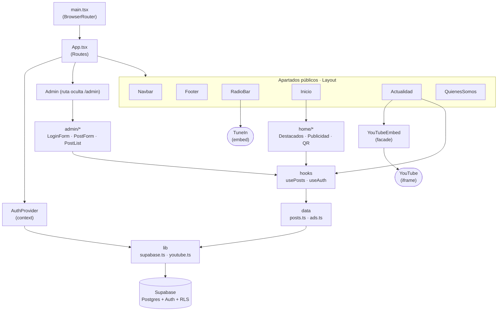

### 14.2 Diagrama de clases (modelo de dominio y servicios)

Tipos del dominio, capa de datos, contexto de autenticación y helper de YouTube.

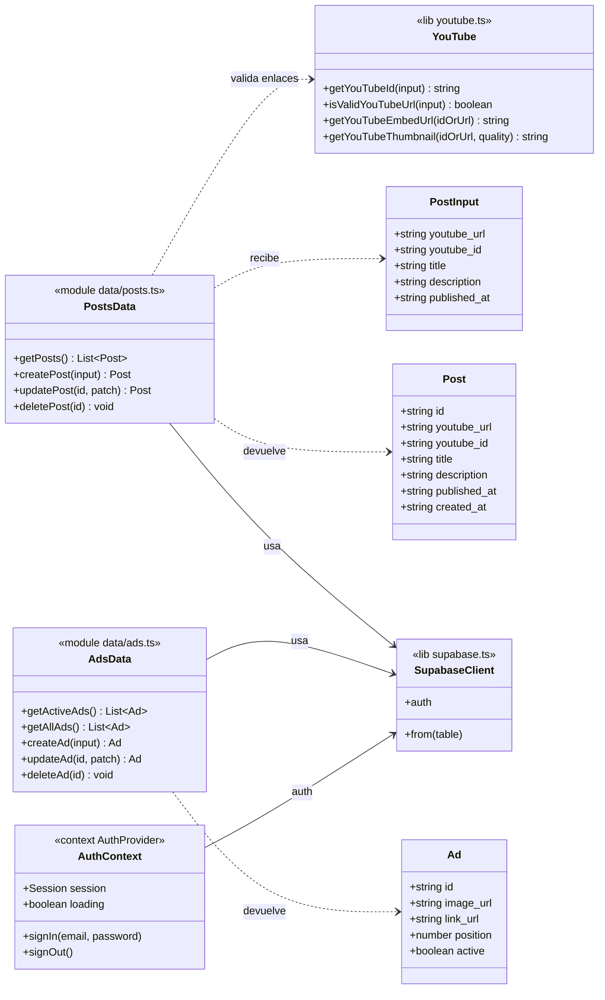

### 14.3 Modelo de datos (entidad-relación)

Tablas en Supabase. Son **independientes** (no hay relación entre ellas); la
seguridad la imponen las políticas RLS descritas en la sección 8.

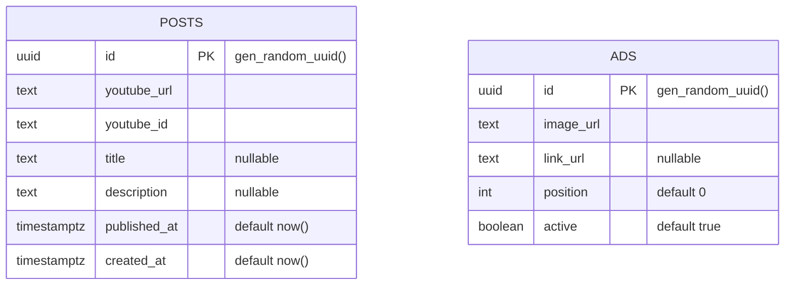

### 14.4 Diagrama de secuencia — Inicio de sesión del administrador

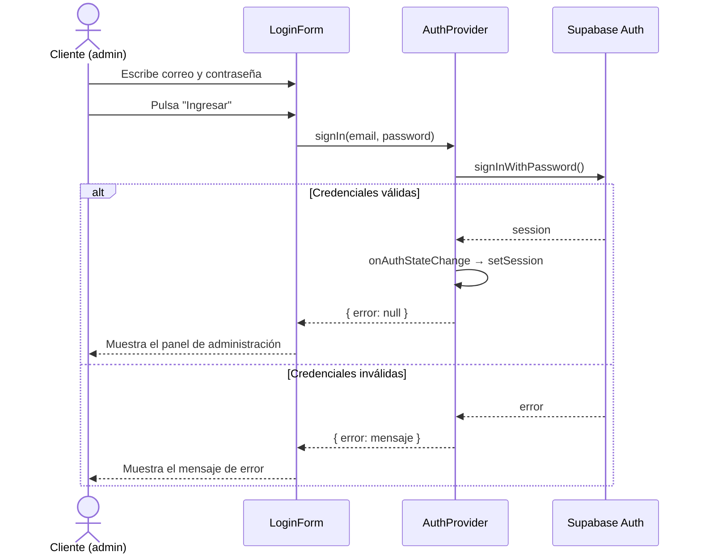

### 14.5 Diagrama de secuencia — Publicar una noticia

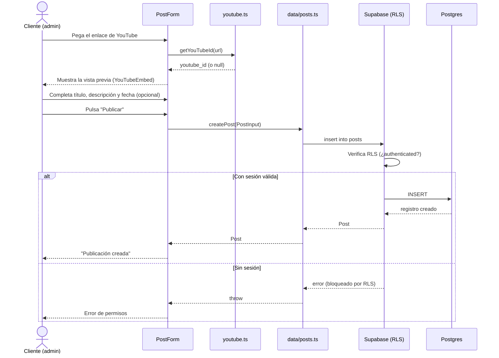

### 14.6 Diagrama de secuencia — Visitante ve Actualidad y reproduce un video

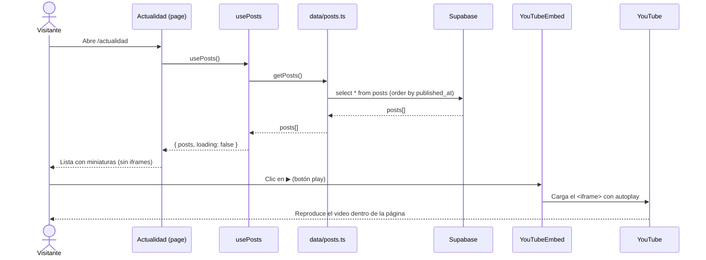

### 14.7 Diagrama de estados — Sesión / autenticación

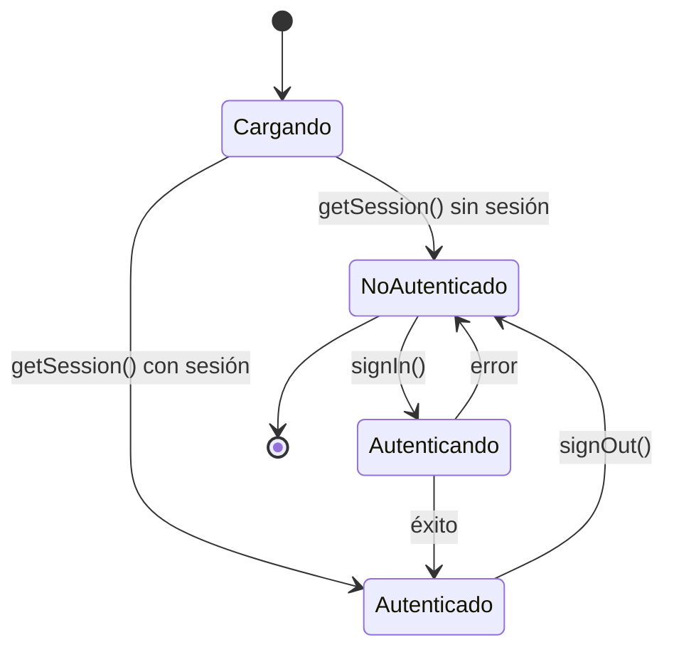

### 14.8 Diagrama de estados — Reproductor diferido (YouTubeEmbed / RadioBar)

Ambos componentes aplican el patrón *facade* para no cargar el embed hasta el
primer gesto del usuario (RNF-02).

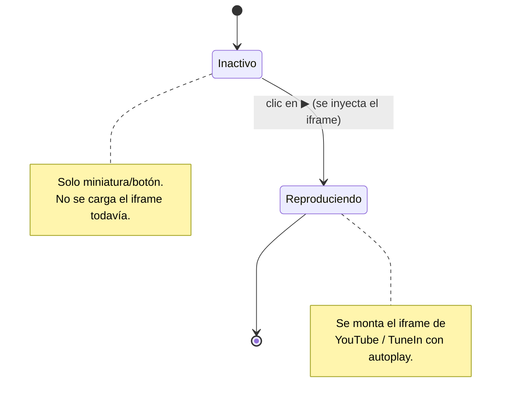

### 14.9 Diagrama de actividades — Flujo de publicación (admin)

Recorre las decisiones clave: sesión, validez del enlace, fecha opcional y RLS.

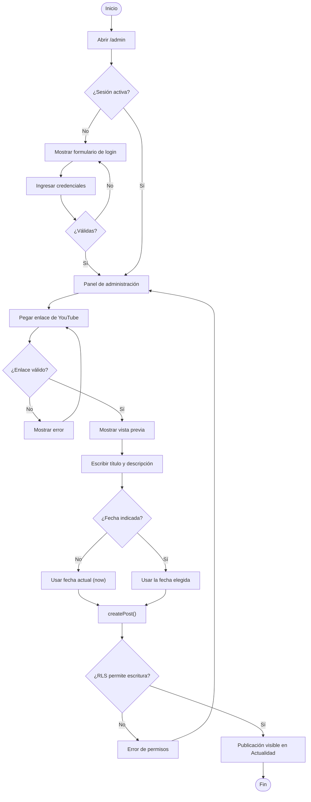

### 14.10 Diagrama de flujo — Extracción del ID de YouTube (`getYouTubeId`)

Lógica del helper `lib/youtube.ts` que soporta los distintos formatos de enlace.

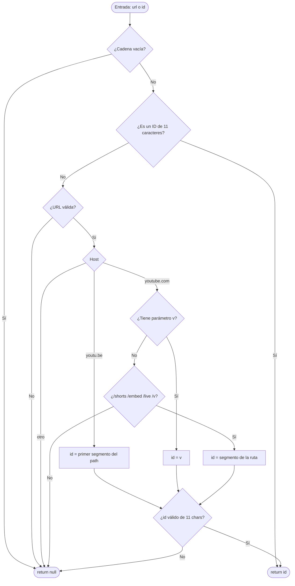

### 14.11 Diagrama de flujo — Mapa de navegación del sitio

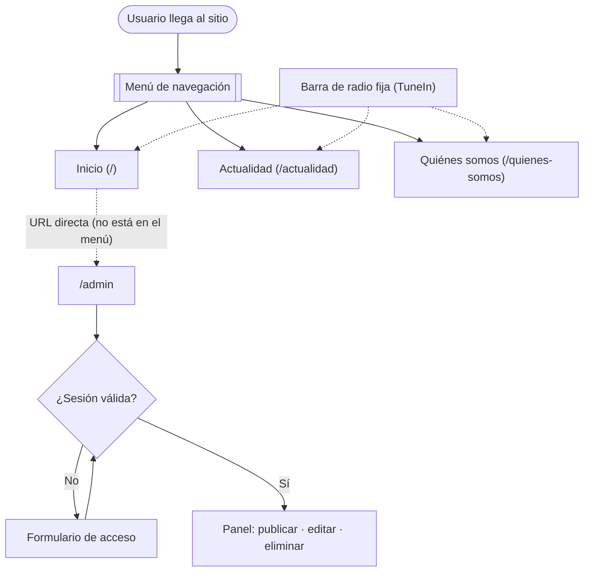

---

## 15. Estado actual y pendientes

### ✅ Hecho (scaffold + infraestructura)

- Proyecto Vite + TS + Tailwind + shadcn/ui configurado y enrutado.
- Cliente de Supabase, contexto de auth, capa de datos (posts/ads) y hooks.
- Helper de YouTube y componente `YouTubeEmbed` (facade) funcionales.
- Layout: Navbar (responsive con hamburguesa), Footer, RadioBar (TuneIn diferido).
- `/admin` protegida con login funcional (placeholder de panel).
- `supabase/schema.sql` con tablas y políticas RLS.
- Documentación y recursos del cliente organizados en `docs/`.

### ⏳ Pendiente

1. `npm install` y verificación de compilación/arranque (si aún no se hizo).
2. Inicializar **Supabase**: proyecto, cuenta del cliente y ejecución del `schema.sql`.
3. Agregar componentes **shadcn/ui** base (button, input, card, textarea…).
4. Implementar **pantalla por pantalla**:
   - **Inicio:** Destacados (RF-11), Zona de publicidad (RF-09), QR de WhatsApp (RF-10).
   - **Actualidad:** lista real de `PostCard` con `YouTubeEmbed` (RF-03).
   - **Quiénes somos:** empresa + contacto (RF-13).
   - **Admin:** `PostForm` (publicar por enlace + vista previa) y `PostList`
     (editar/eliminar) (RF-05, RF-08).
5. Cargar valores reales en `config/site.ts` (TuneIn, WhatsApp, redes, contacto).
6. Integrar los recursos gráficos del cliente (logo, QR, publicidad).
7. SEO (RNF-07), accesibilidad AA (RNF-05) y verificación responsive en
   dispositivos reales.
8. Despliegue en Vercel/Netlify.

---

<p align="center"><sub>EjePresse Radio · Manual Técnico v1.1 · 23-06-2026</sub></p>
